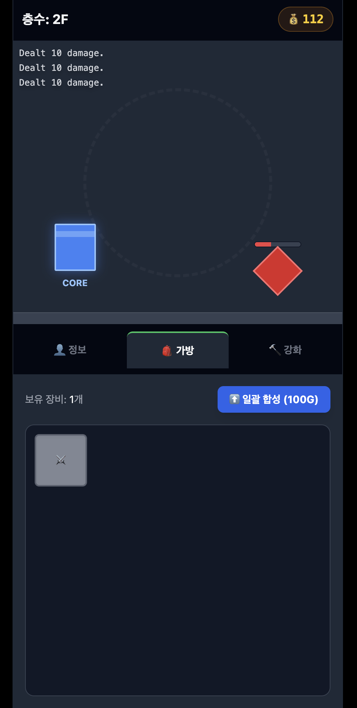
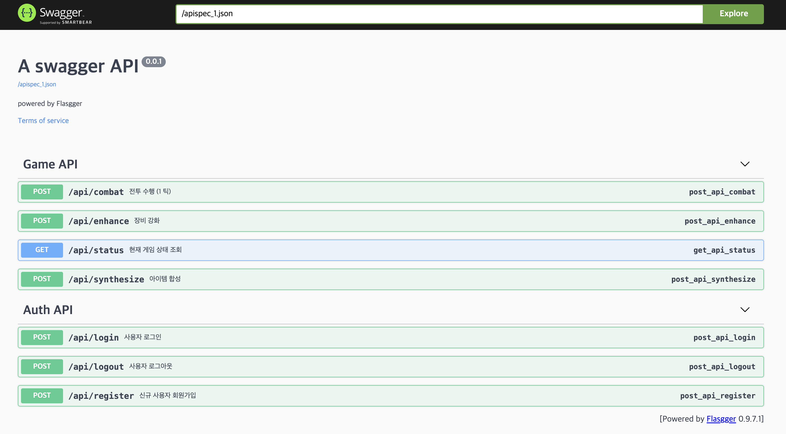

# ⚔️ 아머드 타워 (Armored Tower) MVP
> 안정적이고 확장 가능한 RESTful API 기반 방치형 RPG 시스템

<p align="center">
  
  
</p>
<p align="center">
  <em>▲ 게임 로그인 화면 &nbsp;&nbsp;&nbsp;&nbsp;&nbsp;&nbsp;&nbsp;&nbsp;&nbsp;&nbsp;&nbsp;&nbsp;&nbsp;&nbsp;&nbsp; ▲ 게임 메인 화면 및 전투 UI</em>
</p>

<p align="center">
  
  <br>
  <em>▲ Flasgger를 활용한 인터랙티브 API 명세서</em>
</p>

## 📖 프로젝트 소개 (Motivation & Problem)
단순히 동작만 하는 코드를 넘어, **"유지보수하기 좋고 다른 개발자가 사용하기 쉬운 시스템(DX)"**을 구축하는 것을 목표로 한 미니 프로젝트입니다. 기존의 단순한 함수 형태의 백엔드를 인증(Session)이 포함된 완전한 RESTful API 구조로 리팩토링하였으며, 코드와 문서의 동기화를 위해 자동 문서화 파이프라인을 도입했습니다.

## 🛠 기술 스택 및 도입 배경 (Tech Stack & Rationale)
- **Python / Flask:** 가볍고 유연한 라우팅을 통해 빠르게 게임 로직과 REST API를 구축하기 위해 선택했습니다.
- **Flasgger (OpenAPI):** API 명세서를 코드(Docstring)와 함께 관리하여 '단일 진실 공급원(SSOT)'을 유지하고 프론트엔드와의 협업 효율을 높이기 위해 도입했습니다.
- **Sphinx:** 파이썬 코드의 구조를 분석하고 HTML 기술 문서를 자동 생성하여 유지보수 비용을 줄였습니다.
- **HTML / TailwindCSS / Vanilla JS:** 직관적이고 반응성이 뛰어난 프론트엔드 UI를 구성하기 위해 사용했습니다.

## ✨ 주요 기능 (Key Features)
- **사용자 인증 시스템:** 세션(Session) 기반의 안전한 회원가입, 로그인, 로그아웃 기능 구현
- **RESTful 게임 API:** 상태 조회(GET), 전투/강화/합성(POST) 등 HTTP 메서드 규칙을 준수한 게임 비즈니스 로직
- **인터랙티브 API 명세:** 브라우저에서 즉시 API를 테스트할 수 있는 Swagger UI 제공 (`/apidocs`)
- **자동화된 기술 문서:** Sphinx를 활용한 파이썬 모듈 및 클래스 레벨의 정적 웹 문서 제공

## 🚀 시작하기 (Getting Started)
아래 명령어를 통해 로컬 환경에서 게임 서버와 API 문서를 실행해 볼 수 있습니다.

```bash
# 1. 저장소 클론
git clone [https://github.com/minjun-ludigames2019/OSS_tdd_mini_project.git](https://github.com/minjun-ludigames2019/OSS_tdd_mini_project.git)
cd OSS_tdd_mini_project

# 2. 필수 패키지 설치
pip install -r requirements.txt
# (주의: requirements.txt에 flask, flasgger, sphinx 가 포함되어 있어야 합니다)

# 3. 서버 실행 (포트 충돌 방지를 위해 5001 포트 사용)
flask --app routes run --port=5001
```

## 💡 배운 점 및 도전 과제 (Lessons Learned / Challenges)
1. **API 라우팅 구조 변경과 404 에러 트러블슈팅:** 초기에는 프론트엔드와 백엔드의 통신이 원활하지 않아 게임 진행이 멈추는 현상이 있었습니다. 백엔드를 RESTful API 규격(`/api/...`)과 POST 메서드로 리팩토링한 후, 프론트엔드의 `fetch` 요청 경로를 이에 맞게 수정하면서 클라이언트-서버 간 명확한 엔드포인트 설계와 약속의 중요성을 체감했습니다.
2. **서버 포트 충돌 문제 해결:** Mac 환경에서 AirPlay 수신 모드가 5000번 포트를 점유하여 `403 Forbidden` 에러가 발생하는 문제를 겪었습니다. 서버 실행 포트를 5001번으로 명시적으로 변경(`flask --app routes run --port=5001`)하여 문제를 해결하며, 로컬 개발 환경 인프라 및 네트워크 포트 충돌 대처에 대한 실무적인 경험을 쌓았습니다.
3. **자동화된 문서화 파이프라인의 가치:** 코드와 문서를 분리해서 관리하던 과거와 달리, Docstring 하나만 잘 작성해 두면 Swagger API 인터랙티브 명세와 Sphinx HTML 기술 문서가 동시에 생성되는 환경을 구축했습니다. 이를 통해 '코드 자체가 단일 진실 공급원(SSOT)'이 되어, 유지보수 비용을 획기적으로 줄이는 좋은 개발자 경험(DX)의 가치를 깊이 깨달았습니다.

---

### 📚 기술 문서 링크
* **Sphinx 자동 생성 기술 문서:** [https://minjun-ludigames2019.github.io/OSS_tdd_mini_project/build/html/index.html](https://minjun-ludigames2019.github.io/OSS_tdd_mini_project/build/html/index.html)